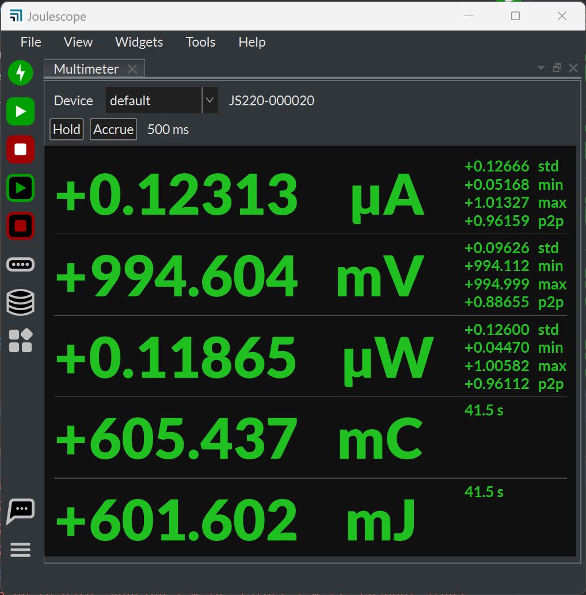
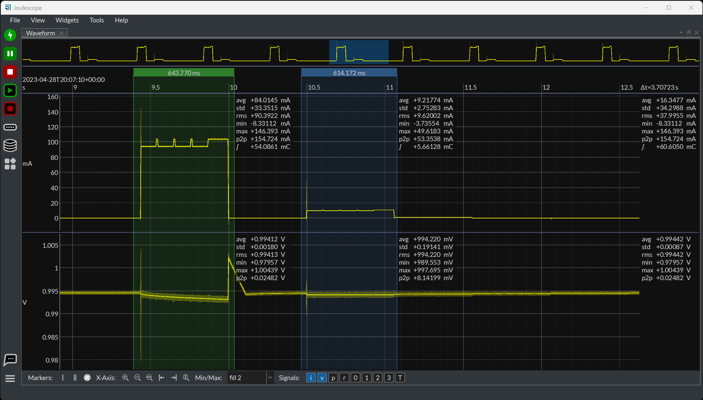

# 

Welcome to the Joulescope™ User Interface software repo!
Joulescope is an affordable, precision energy
analyzer that enables you to build better products.
Joulescope™ accurately and simultaneously measures the voltage and current
supplied to your target device, and it then computes power and energy.
For more information on Joulescope, see
[www.joulescope.com](https://www.joulescope.com).

This repository contains the Joulescope graphical User Interface (UI).
The UI runs on a host computer and communicates with the Joulescope device
over USB.  The application source code is available at
https://github.com/jetperch/pyjoulescope_ui.  

The software is highly configurable.  Here is the Multimeter view on Windows 11:

And here is the Oscilloscope view on Windows 11:

For more information, see:

* [Tips](docs/tips.md): for using the UI.
* [Changelog](CHANGELOG.md): list of changes by release
* [Future features](docs/features_future.md)
* [Contributing](CONTRIBUTING.md)
* [Code of Conduct](CODE_OF_CONDUCT.md)
* [Developer notes](docs/dev.md)
* [PubSub](docs/pubsub.md)

## Quick start using official distribution

We provide official distributions for Windows, macOS and Ubuntu 22.04LTS.

Visit the main [download](https://www.joulescope.com/download) 
page for the latest stable build.

You can download the latest and previous alpha, beta, and stable builds
[here](https://download.joulescope.com/joulescope_install/index_v2.html).

## Run as python package

The Joulescope UI is a python package which you can install for pypi or
run directly from source.

### Install Python

The Joulescope User Interface requires Python 3.9 or newer.
We recommend Python 3.11.
Install [Python 3.9+](https://www.python.org/) on your system and then verify
your python version at the terminal or command line:

    > python -VV
    Python 3.11.4 (tags/v3.11.4:d2340ef, Jun  7 2023, 05:45:37) [MSC v.1934 64 bit (AMD64)]

Ensure that you have Python 3.9 or newer and 64-bit.
For macOS, you can also use
[Homebrew](https://docs.brew.sh/Installation)
to [install python](https://docs.brew.sh/Homebrew-and-Python).

### Configure virtualenv [optional]

Although not required, using
[virtualenv](https://virtualenv.pypa.io/en/latest/)
avoids dependency conflicts, especially if you use your python installation for
other programs.  Using virtualenv ensures that
the Joulescope software has the right dependencies without changing the rest
of your system.

#### For Windows:

Install virtualenv and create a new virtual environment:

    python -v venv c:\venv\joulescope

Activate the virtual environment whenever you start a new terminal:

    c:\venv\joulescope\Scripts\activate

#### For POSIX including (Linux, macOS):

Install virtualenv and create a new virtual environment:

    python -m venv ~/venv/joulescope

Activate the virtual environment whenever you start a new terminal:

    . ~/venv/joulescope/bin/activate

### Install using pypi

Installation from pypi is easy:

    python -m pip install -U --upgrade-strategy=eager joulescope_ui
    
If you just want to run the latest released version of the UI.

For Linux, you need to perform additional steps.  Here are steps for
Ubuntu:

    sudo apt install libudev-dev libxcb-cursor0
    wget https://raw.githubusercontent.com/jetperch/joulescope_driver/main/99-joulescope.rules
    sudo cp 99-joulescope.rules /etc/udev/rules.d/
    sudo udevadm control --reload-rules

If you receive the error:
`Could not load the Qt platform plugin "xcb" in "" even though it was found`,
you need to install additional dependencies.  First identify the 
missing dependencies:

    export QT_DEBUG_PLUGINS=1
    python3 -m joulescope_ui

Then install them using apt or your distribution's package manager.
The Joulescope UI uses Qt6, and you can find the Qt6 dependencies
[here](https://doc.qt.io/qt-6/linux-requirements.html).

### Run

Whenever you want to run the Joulescope UI:

    python -m joulescope_ui

Depending upon your system, you may need to replace "python" 
with "python3" or the full path to your python executable.

The joulescope package also contains an executable, so you can often type:

    joulescope ui

## Developer Howto

Clone and configure the Joulescope UI from the terminal or command line:

    git clone https://github.com/jetperch/pyjoulescope_ui.git
    cd pyjoulescope_ui
    python -m pip install -U --upgrade-strategy eager -r requirements.txt

Build the QT resources:

    python setup.py sdist

As long as the current directory is the source directory, you can run:

    python -m joulescope_ui

If you want to run from another directory, you will need to add the source
to your PYTHONPATH environment variable.  

Windows using command prompt:

    set PYTHONPATH={C:\path\to\repos}\pyjoulescope_ui

Windows using PowerShell:

    $env:PYTHONPATH = "{C:\path\to\repos}\pyjoulescope_ui"

POSIX shells (most Linux, macOS with homebrew):

    export PYTHONPATH={path/to/repos}/pyjoulescope_ui

To also distribute the UI on macOS, you need to install XCode and then
configure node.  If using homebrew:

    brew install node
    npm install

You will also need to install the signing certificate using
Applications/Utilities/Keychain Access.

If you also want to simultaneously develop the Joulescope UI and the
Joulescope driver, you can include the joulescope_driver in 
your PYTHONPATH and build in place:

    pip3 uninstall joulescope
    cd {path/to/repos}
    git clone https://github.com/jetperch/joulescope_driver.git
    cd joulescope_driver
    pip3 install -U -r requirements.txt
    python setup.py build_ext --inplace && python -m unittest
    git clone https://github.com/jetperch/pyjoulescope.git
    cd pyjoulescope
    pip3 install -U -r requirements.txt    
    python setup.py build_ext --inplace && python -m unittest

You should then modify your python path to find both the UI and driver
source paths. On Windows:

    set PYTHONPATH={C:\path\to\repos}\joulescope_driver;C:\path\to\repos}\pyjoulescope;{C:\path\to\repos}\pyjoulescope_ui

and on POSIX (Linux, Mac OS X with homebrew):

    export PYTHONPATH={path/to/repos}/pyjoulescope:{path/to/repos}/pyjoulescope_ui

## License

All pyjoulescope_ui code is released under the permissive Apache 2.0 license.
See the [License File](LICENSE.txt) for details.
